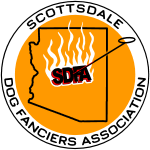

# Scottsdale Dog Fanciers Association Website

What will eventually become the official source for https://scottsdaledogfanciersassn.com; a NEAT (**N**etlify CMS, **E**leventy, **A**lpine JS & **T**ailwind CSS) website.

### Technologies used:

- [Netlify CMS](https://www.netlifycms.org/)
- [Eleventy](https://www.11ty.dev/)
- [Alpine.js](https://github.com/alpinejs/alpine)
- [Tailwind CSS](https://tailwindcss.com/)

